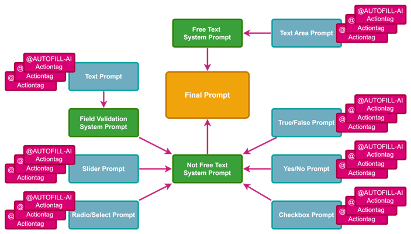

# Autofill AI External Module

Autofill AI integrates large language models (LLM) into REDCap to generate realistic, context-sensitive test data for instruments using customizable prompts. This external module is also intended to simplify the creation of complex test data, such as free text in notes.

There are currently three places where the module interacts with REDCap:

1. in the designer to optimize a LLM prompt and save it in the action tag `@AUTOFILL-AI`
2. in the data entry to fill out an entire form (admins only)
3. in a new so-called factory page where forms can be filled out in larger scale

**Warning**: The use of this module may result in the leakage of personal data. It should only be used in testing scenarios and in consultation with the responsible data protection officers.

**Warning**: This is a pre-release version and is not yet ready for productive use. Please use it with caution. The use of commercial LLM providers may result in costs.

**Feature and pull requests** (against _main_) are welcome and highly appreciated!

## Features

- integrates two popular generative AI APIs (OpenAI, Google) to create synthetic test data
- uses a multi-step prompting approach to keep user prompts short and concise
- support for all basic REDCap data types (text, notes, radio, drop-down, checkbox, slider, yes/no, true/false)
- supports piping and introduces "smart variables" to concatenate prompts and other metadata such as choices
- prompt engineering user interface as part of the Designer
- instrument-level test option during data entry
- test data generation for multiple datasets using an additional module page (*factory*)

*multi-stage prompting approach*

## Known Issues / Limitations

- initially developed with REDCap's 'classic' data collection format in mind, this external module may not work as expected with active longitudinal data collection or repeated instruments
- Autofill AI factory for mass data generation is still rudimentarily implemented
- matrix field groups are not yet supported

## Requirements

- REDCap 13.3.0 or newer
- PHP 7.4.0 or newer

## Installation

- Clone this repository into `<redcap-root>/modules/autofill_ai_v<version-number>`.
- Go to the *External Modules - Module Manager* (*Control Center* -> *External Modules* -> *Manage*) and enable the module there with the proper version.

## Configuration

The configuration is done exclusively within the project context. The following settings are available:

- *javascript-debug*: Output debug information to the browser console (enable these **only** during testing!)
- *llm-provider-desc*: Descriptive label for the used Large Language Model (LLM) provider
- *llm-provider*: Specific LLM provider API
    - currently the following APIs are implemented:
        - OpenAI (*GPT-3.5-turbo*, *GPT-4* or newer)
        - Google (recent models like *Gemini 1.5 Flash*)
- *llm-mock-mode*: Bypass the LLM API and simulate its real behavior by answering to the great questions of life, the universe and everything
- *llm-api-key*: API key for the chosen provider
- *llm-model-name*: Model name (technical)
    - external module was sucessfully tested with
        - `gpt-4o-mini`
        - `gemini-1.5-flash`
- *llm-pricing-input-tokens*: Pricing: USD / 1M input tokens
- *llm-pricing-output-tokens*: Pricing: USD / 1M output tokens
    - take this from the pricing pages of the providers
- *llm-pricing-vat*: VAT (in percent) if applicably, enter "0" if not
- *llm-local-currency*: Local currency, USD is default
- *llm-local-currency-rate*: Exchange rate (in local currency per USD), 1.00 is default
- *llm-total-costs-usd*: Total cumulative costs (in USD)
- *llm-system-prompt-freetext*: General LLM system prompt for notes (freetext), can left empty if wanted
- *llm-system-prompt-no-freetext*: Additional LLM system prompt for structured fields (everything except notes)
    - could be something like: *Act like a computer interface. Response strictly with facts and do not include any explanation. Do not enumerate the results. Every result in a new line.*
- *llm-system-prompt-text*: Specific LLM system prompt for *text*
    - cound be something like: *[prompt-general] A list of items. Only values. [prompt-validation]*
        - *[prompt-general]* is replaced by *llm-system-prompt-no-freetext*
        - *[prompt-validation]* creates a special prompt which helps the LLM to respect REDCap's field validation
- *llm-system-prompt-notes*: Specific LLM system prompt for *notes*
    - could consist only of *[prompt-general]*
- *llm-system-prompt-radio-dropdown*: Specific LLM system prompt for *radio* or *dropdown*
    -  effective prompts look like this: *[prompt-general] Response strictly with the codes in the first column of this table and nothing else:\n[prompt-choices]\nOnly codes!*
- *llm-system-prompt-checkbox*: Specific LLM system prompt for *checkbox*
- *llm-system-prompt-yesno*: Specific LLM system prompt for *yesno*
- *llm-system-prompt-truefalse*: Specific LLM system prompt for *truefalse*
    -  same hint as for *radio* or *dropdown*
- *llm-system-prompt-slider*: Specific LLM system prompt for *slider*
    - a suitable prompt could look like this: *[prompt-general] Response with an integer number between 0 and 100. 0 means minimum and 100 maximum.*

## Action Tags

### @AUTOFILL-AI

This action tag contains the LLM prompt, such as `@AUTOFILL-AI='What is the shortest distance in miles (rounded on 100 miles) between Seattle and Florida?'`. The prompt can also be created and/or modified using the robot icon in the forms designer.

## Effects

### Instrument designer

A new button depicting a robot is added. It triggers a dialog where the LLM prompts can be modified and tested.

Todo: complete documentation

### Data entry

Below the *Auto-Fill* button, another button labeled with *Autofill AI* is added. It triggers the completion of empty fields based on a prompt available in the `@AUTOFILL-AI` action tag.

Todo: complete documentation

### Factory

This is a new, module specfic page intended to mass complete forms with LLM prompt. Currently, only a simple operation model using the prompts in the action tag `@AUTOFILL-AI` is supported:

*Operation mode Data Element Context*: Context is limited to the content of the Action Tag @AUTOFILL-AI.

Further operation model will be added soon.

Todo: complete documentation

## Changelog

Version | Description
------- | --------------------------------------------------------------------
v0.9.0  | Pre-Release for the REDCapCon 2024 - happy 20th anniversary, REDCap!
